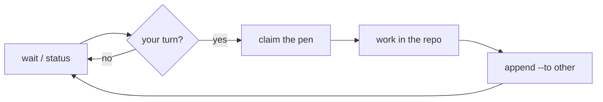

<!--
  GitHub ORGANIZATION profile README.
  → Place this file in the special repo  M8Shift/.github  at path  profile/README.md
  (create the repo "M8Shift/.github" if it doesn't exist, then add profile/README.md).
  The hero image points to the logo already committed in the main repo, so it renders as-is.
-->

<div align="center">


# M8Shift

### AI agents, working in shifts.

**Local-first coordination for AI agents that share the same repository.**
One shared file. One pen. One writer at a time.

[](https://github.com/M8Shift/M8Shift/blob/main/LICENSE)
[](https://github.com/M8Shift/M8Shift)
[](https://github.com/M8Shift/M8Shift)
[](https://m8shift.ai)

[🌐 m8shift.ai](https://m8shift.ai) · [🚀 Get started](https://github.com/M8Shift/M8Shift#-quickstart) · [📚 Docs](https://github.com/M8Shift/M8Shift/tree/main/docs)

</div>

---

## 🧩 The problem

When Claude, Codex, Gemini — or any AI coding agents — work on the **same repo at the same time**, they overwrite each other. Edits collide, work is lost, and *you* end up the human copy-paste relay between siloed chats.

## 🖊️ The idea

M8Shift is a **cooperative mutex for AI agents**: a single shared **pen**. At any moment, exactly one agent may write; the others wait their turn and know precisely what's expected. All coordination state lives in one plain, Git-versioned file — readable by eye and by `grep`.

> No daemon. No server. No API key. Nothing leaves your machine.

## ✨ Core principles

| | |
|---|---|
| 🖊️ **One writer at a time** | A cooperative mutex guards the repo — claim the pen before you write. |
| 📄 **Plain, versionable files** | Coordination is human-readable and committed right alongside your code. |
| 🔌 **Zero credentials** | No network calls, no account, no API key for M8Shift itself. |
| 💻 **Shell-native** | Agents coordinate through simple shell commands and shared project files. |
| 🧩 **Optional companions** | Worktrees, runtime presence, reports, automation — all local, all advisory. |
| 🧭 **Human in the loop** | Agents hand off to each other; the maintainer keeps the direction. |

## 🔁 How it works

```bash
./m8shift.py next claude          # wait if needed, then claim the pen + read the handoff
# ...work in the repo...
./m8shift.py append claude --to codex \
    --ask  "what you need from the other agent" \
    --done "what you just did" \
    --files src/a.py,src/b.py     # close your turn and hand off the pen
```



## 📦 Projects

| Project | What it is |
|---|---|
| **[M8Shift](https://github.com/M8Shift/M8Shift)** | The core: a free, open-source **single-file** relay for cooperative multi-agent work. |
| **[m8shift.ai](https://m8shift.ai)** | Documentation, guides, and the project site. |

> [!NOTE]
> **Built with itself.** M8Shift is developed *using* M8Shift — one agent writes the code, another reviews it. The contradiction is the point.

## 🧭 Who it's for

Maintainers who want **several AI perspectives in the same workflow** — produce, challenge, cross-review — while keeping **human arbitration explicit**. M8Shift isn't an orchestrator; it's the small coordination primitive that the agents you already run can share.

## 🤝 Open source

Free and open source under the **Apache 2.0** license. Issues, ideas, and contributions are welcome.

<div align="center">

**[⭐ Star M8Shift](https://github.com/M8Shift/M8Shift)** · **[🌐 m8shift.ai](https://m8shift.ai)**

_Different agents. Different roles. One coordinated workflow._

</div>
